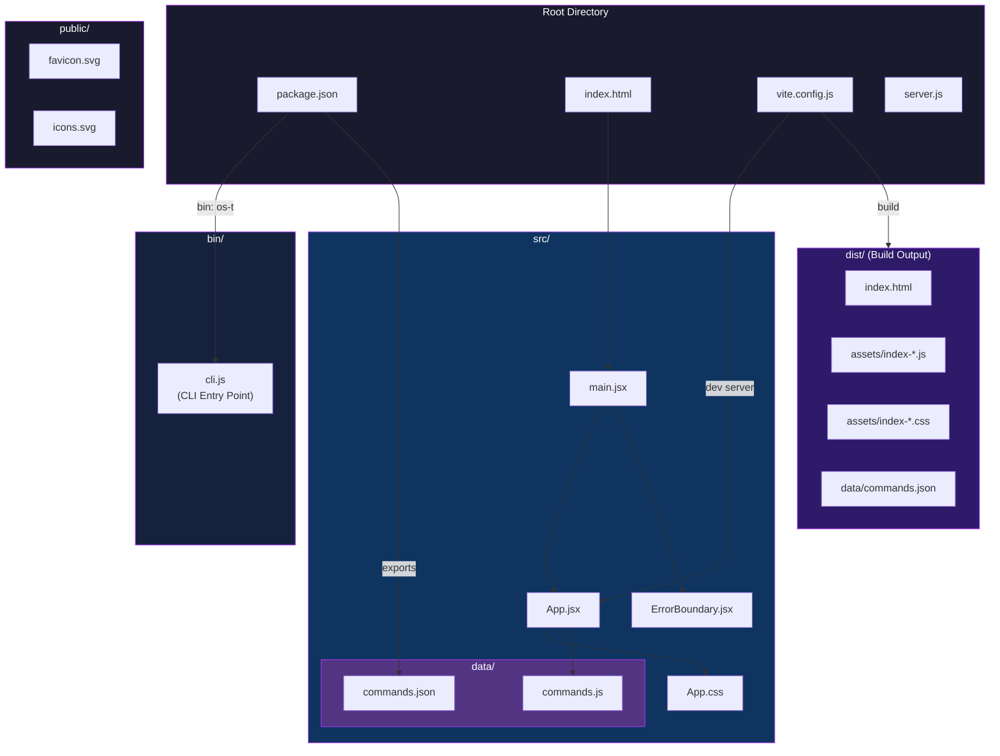
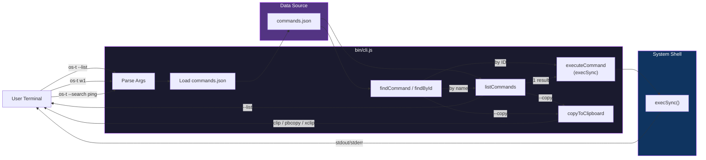
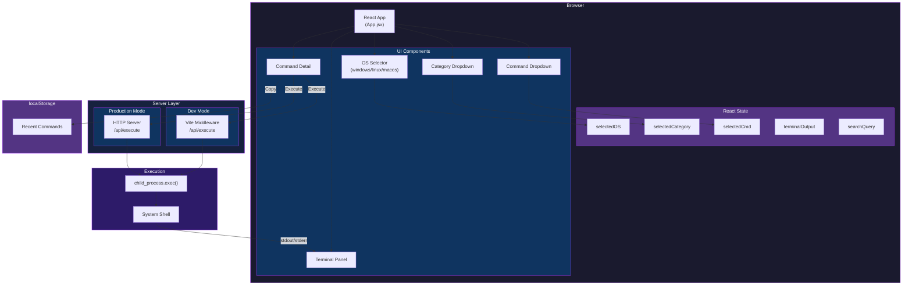
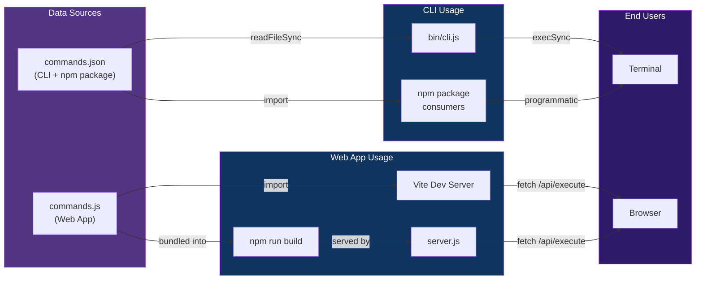
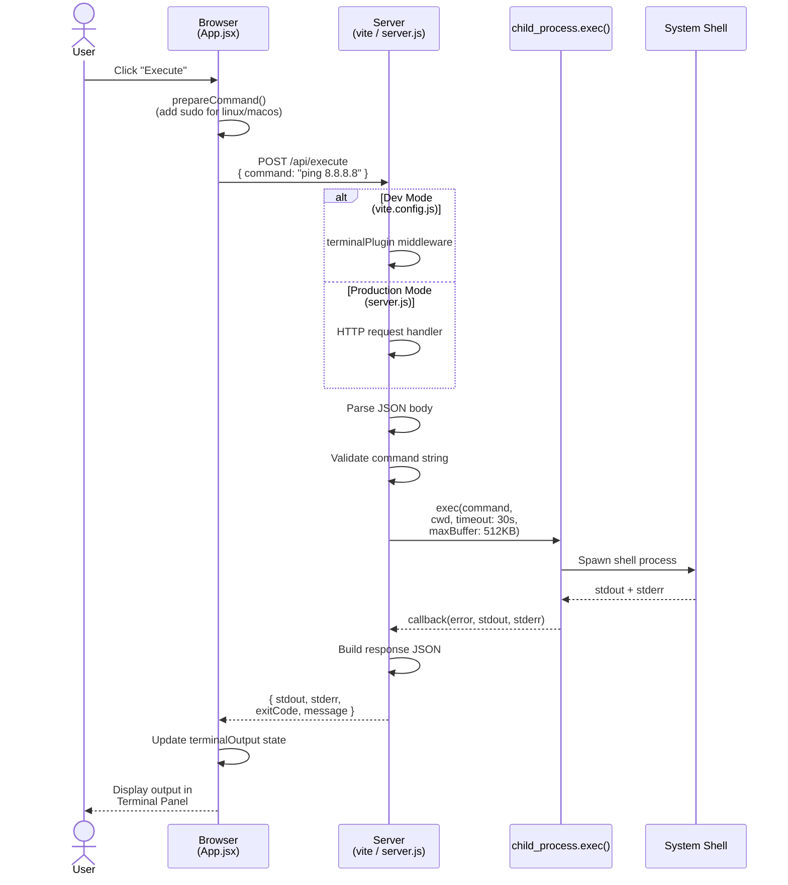
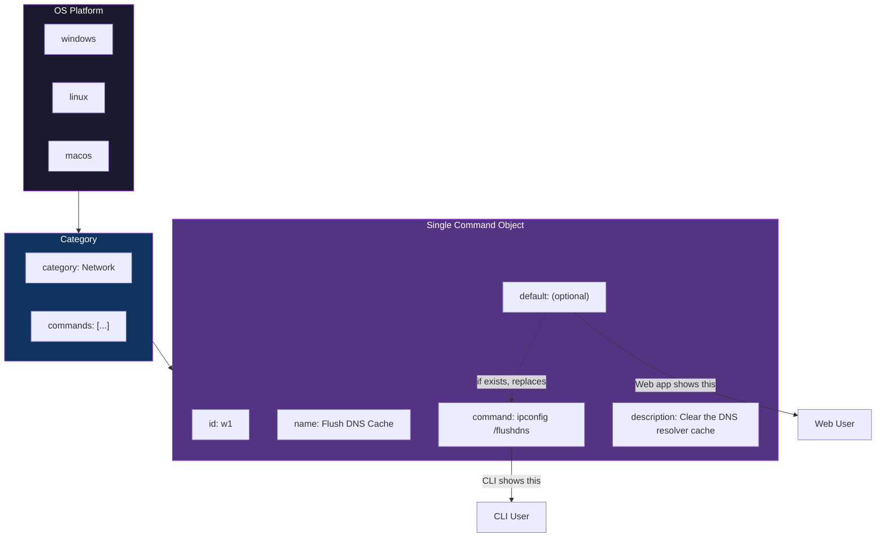
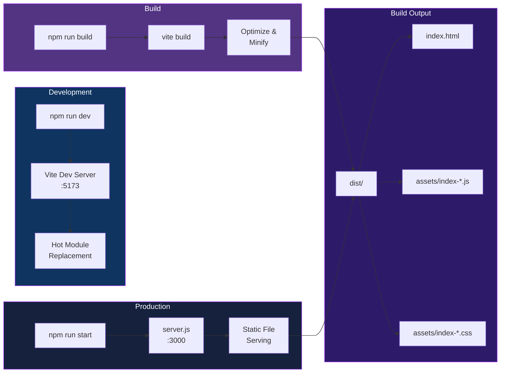
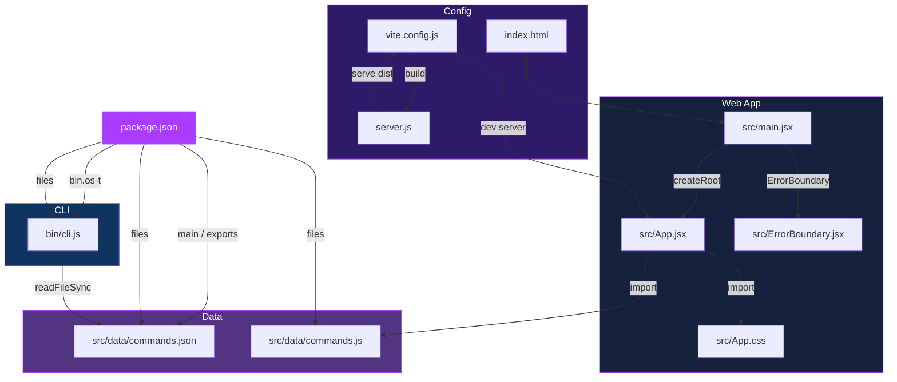

# OS Troubleshooter - Architecture

## Project Structure

## CLI Architecture

## Web App Architecture

## Data Flow

## API Execute Flow

## Command Data Structure

## Build Process

## File Relationships

